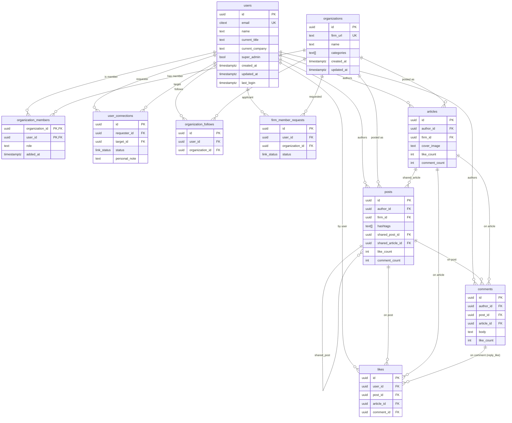

# Professional Network — Relational ERD

Notes:
- `posts`/`articles` → `organizations` (`firm_id`) is optional (`ON DELETE SET NULL`).
- `comments` targets exactly one of `post_id`/`article_id`; `likes` exactly one of
  `post_id`/`article_id`/`comment_id` (CHECK constraints).
- `likes.comment_id` is the self-referential Mongo `reply_like`.
